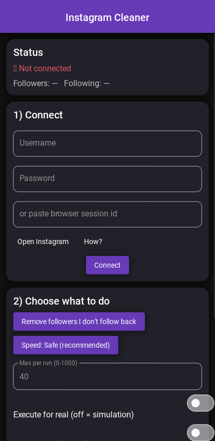

# Instagram Cleaner

Remove the Instagram accounts that **follow you but that you don't follow back**,
or **unfollow** the people you follow — safely, with a limit you choose and
human-like delays. Available as a **Windows/macOS/Linux desktop app** and an
**Android app**.

[](https://github.com/scrimslf/instagram-cleaner/releases/latest)
[](https://github.com/scrimslf/instagram-cleaner/releases)
[](LICENSE)


> ⚠️ **Read this first.** Automating actions violates Instagram's Terms of
> Service. Even with every precaution here, a **temporary block or a permanent
> suspension is possible**. Use it on your own account, at your own risk, and go
> slow. If Instagram shows a security "challenge" or a "please wait" message,
> **stop for a few days**.

---

## ⬇️ Get it

| Platform | How to get it |
|----------|---------------|
| 🤖 **Android** | **[⬇️ Download the APK](https://github.com/scrimslf/instagram-cleaner/releases/latest/download/InstagramCleaner-Material.apk)** — open this link on your phone, install, done. |
| 🪟 **Windows** / 🍎 **macOS** / 🐧 **Linux** | Run the desktop app — see [Desktop install](#-desktop-windows--macos--linux) below. |

<p align="center">
  
</p>

---

## 🤖 Android

1. On your phone, open the **[Download APK](https://github.com/scrimslf/instagram-cleaner/releases/latest/download/InstagramCleaner-Material.apk)** link.
2. Open the downloaded `.apk` file.
3. Allow **"install from unknown sources"** if Android asks.
4. Open **Instagram Cleaner** and log in (see [Logging in](#-logging-in)).

*It's a debug APK for sideloading (not on the Play Store, which forbids
Instagram automation). It runs entirely on your phone — nothing is uploaded.*

## 🪟 Desktop (Windows / macOS / Linux)

**Install (once):**

```bash
git clone https://github.com/scrimslf/instagram-cleaner.git
cd instagram-cleaner
# Windows:
.\setup.ps1
# macOS / Linux:
bash setup.sh
```

**Run the graphical app:**

```bash
python gui.py
```
On Windows you can also double-click **`run_gui.bat`** (or `run_gui_admin.bat`
to let "Import from browser" read your cookies).

**Or use the command line:**

```bash
python clean_followers.py                               # dry-run, remove non-followers
python clean_followers.py --mode unfollow-nonmutual     # dry-run, unfollow non-mutuals
python clean_followers.py --limit 40 --execute          # actually act on up to 40
```

---

## ✨ Features

- 🧪 **Dry-run by default** — see who *would* be affected before anything happens.
- 🎯 **Three modes** — remove followers you don't follow back, unfollow non-mutuals,
  or unfollow everyone you follow.
- 🔢 **Pick how many** — 0 to 1000 per run. **100 is the recommended safe ceiling**;
  above that you get a warning.
- 🐢 **Speed presets** — Safe / Medium / Fast (faster = higher block risk).
- 🔐 **2FA handled** — enter your code in-app; security challenges handled too.
- ♻️ **Session reuse** — log in once; later runs are instant.
- ⏸️ **Human-like pacing** + resumable progress + a whitelist.
- 🔒 **No server, no secrets uploaded** — everything runs on your device.

## 🔑 Logging in

Two ways, in the app:

- **Browser session (most reliable):** log into instagram.com in your browser,
  copy the `sessionid` cookie, and paste it in the app. On desktop, the
  **"Import from browser"** button can grab it automatically (run as admin on
  recent Brave/Chrome, which encrypt cookies).
- **Username + password:** a prompt asks for your 2FA code if needed.

Your login is stored **only on your device** (`session.json`) and never uploaded.

## 🛡️ Staying safe

- Start with a **low number (30–50)** for the first days, at **Safe** speed.
- **Run once a day.** The tool remembers what it already did.
- Stay **at or below 100** per run.
- On any Instagram "challenge" / "please wait", **stop for a few days**.

## 🧑‍💻 Build from source

- **Android APK:** built automatically by GitHub Actions
  ([`.github/workflows/build-apk.yml`](.github/workflows/build-apk.yml)); grab the
  artifact, or build locally — see [`mobile/README.md`](mobile/README.md).
- **Desktop:** pure Python — `pip install -r requirements.txt` then `python gui.py`.

## 📁 Generated files (never committed)

`session.json` (your login), `state.json` (progress), `targets_cache_*.json`,
`config.json` (optional settings). All are in `.gitignore`.

## ⚖️ Disclaimer

Provided "as is" under the MIT License, with no warranty. Not affiliated with,
endorsed by, or connected to Instagram or Meta. You are solely responsible for
how you use it and for any consequences to your account.
